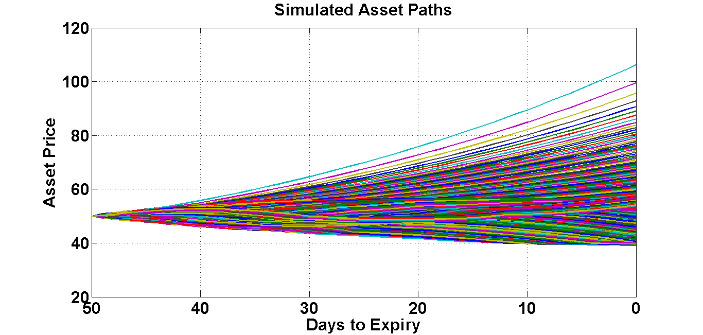
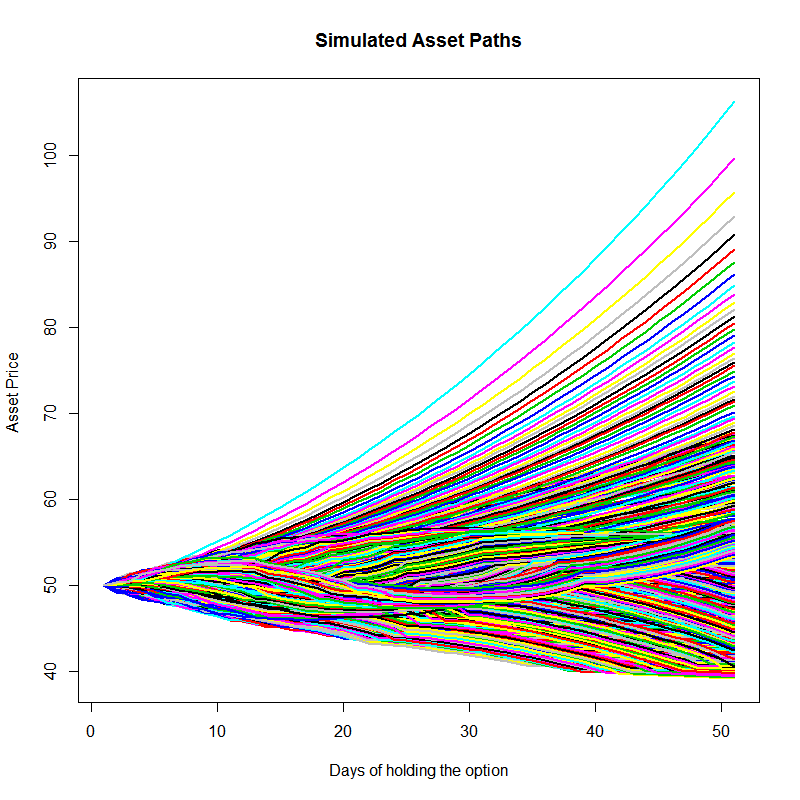

# SFM10Halton_priAsiopt
Pricing the Asian option by applying the Halton sequence
+
[](http://quantlet.de/index.php?p=info)
+
+## [](http://quantlet.de/) **SFM10Halton_priAsiopt** [](http://quantlet.de/d3/ia)
+ 
+ ```yaml
+
+Name of Quantlet: SFM10Halton_priAsiopt
+
+Publishe in: Statistics of Financial Markets
+
+Description: 'Generates and plots multiple asset paths and prices Asian Call and Put options by applying the random numbers +generated from the Halton sequence '
+
+Keywords: 'plot, graphical representation, simulation, option-price, call, put, random-number-generation, +geometric-brownian-motion, monte-carlo '
+
+Author: Xu Yunkun 
+Author[Matlab]: Chai Qingqing
+
+Submitted:  2016/07/13
+
+Input: 
+-S0: price of underlying today
+-mu: expected return
+-sig: volatility
+-dt: size of time steps
+-steps: number of time steps to calculate
+-nsims: number of simulation paths to generate
+-X: strike at expiry
+-r: risk free rate
+
+Output: 'plot of simulated asset paths and prices of Asian Call and Put options'
+
+```
+ 
+
+ 
+
+
+
+### R Code:
+```r
+ # clear variables and close windows
+rm(list = ls(all = TRUE))
+graphics.off()
+
+# install and load packages
+install.packages("pracma")
+library(pracma)
+install.packages("timeSeries")
+library(timeSeries)
+install.packages("graphics")
+library(graphics)
+# functions
+localHaltonSingleNumber = function(n, b) {
+   n0 = n
+    hn = 0
+   f = 1/b
+    while (n0 > 0) {
+        n1 = floor(n0/b)
+        r = n0 - n1 * b
+        hn = hn + f * r
+        f = f/b
+        n0 = n1
+    }
+    hn
+}
+HaltonSequence = function(n, b) {
+    hs = rep(0, n)
+    for (idx in 1:n) {
+        hs[idx] = localHaltonSingleNumber(idx, b)
+    }
+    hs
+}
+BoxMueller = function(hs1, hs2) {
+    R = sqrt(-2 * log(hs1))
+    Theta = 2 * pi * hs2
+    P = R * sin(Theta)
+    Q = R * cos(Theta)
+    sequence = c(P, Q)
+    sequence
+}
+
+AssetPathsHalton = function(S0, mu, sig, dt, steps, nsims) {
+   pVec = primes(1e+05)
+    a = 2 * steps
+    bases = pVec[1:a]
+    nu = mu - sig * sig/2
+    epsilon = matrix(1, steps, nsims)
+    for (idx in 1:steps) {
+        epsH1 = HaltonSequence(nsims/2, bases[idx])
+        epsH2 = HaltonSequence(nsims/2, bases[steps + idx])
+        c = BoxMueller(epsH1, epsH2)
+        epsilon[idx, ] = t(c)
+    }
+    b = exp(nu * dt + sig * sqrt(dt) * epsilon)
+    f = matrix(1, steps, nsims)
+    for (ids in 1:nsims) {
+        e = b[, ids]
+        f[, ids] = cumprod(e)
+    }
+    g = matrix(1, 1, nsims)
+    h = rbind(g, f)
+    S = S0 * h
+    S
+}
+#### parameter setting
+S0 = 50
+# Price of underlying today
+mu = 0.04
+# expected return
+sig = 0.1
+# expected volatility
+dt = 1/365
+# time steps
+steps = 50
+# days to expiry
+nsims = 1000
+# Number of simulated paths
+X = 50
+# Strike at expiry
+r = 0.03
+# Risk free rate
+T = dt * steps
+# Plot the asset paths
+S = AssetPathsHalton(S0, mu, sig, dt, steps, nsims)
+matplot(S, lwd = 2, type = "l", lty = 1, ylim = c(min(colMins(S)), max(colMaxs(S))), col = 1:nsims, main = "Simulated Asset +Paths", 
+    xlab = "Days of holding the option", ylab = "Asset Price ")
+
+# Price a standard Asian Put and Call option
+i = X - colMeans(S)
+PutPayoffT = rep(0, nsims)
+CallPayoffT = rep(0, nsims)
+for (idx in 1:nsims) {
+   PutPayoffT[idx] = max(i[idx], 0)
+   CallPayoffT[idx] = max(-i[idx], 0)
+}
+putPrice = mean(PutPayoffT) * exp(-r * T)
+callPrice = mean(CallPayoffT) * exp(-r * T)
+print(putPrice)
+print(callPrice)
+
+```
+
+### MATLAB Code:
+```matlab
+
+% clearing work&preparing
+clear
+close all
+clc
+% parameter setting
+S0 =50;       % Price of underlying today
+X = 50;       % Strike at expiry
+mu = 0.04;    % expected return
+sig = 0.1;    % expected vol.
+r = 0.03;     % Risk free rate
+dt = 1/365;   % time steps
+steps = 50;   % days to expiry
+T = dt*steps; % years to expiry
+nsims = 1000; % Number of simulated paths
+%%%%%%%%%%%%%%%%%%%%%%%%%%%%%%%%%%%%%%%%%%%%%%%%%%%%%%%%%%%%%%%%%%%%%%%%%%%%%%%%%%%%%%%%%%%%%%%% 
+function hs = HaltonSequence(n,b)    
+hs = zeros(n,1);
+for idx = 1:n
+    hs(idx) = localHaltonSingleNumber(idx,b);
+end
+function hn = localHaltonSingleNumber(n,b)
+n0 = n;
+hn = 0;
+f = 1/b;
+while (n0>0)
+    n1 = floor(n0/b);
+    r = n0-n1*b;
+    hn = hn + f*r;
+    f = f/b;
+    n0 = n1;
+end
+%%%%%%%%%%% Function to generates the first n numbers in Halton's low discrepancy sequence with base b
+
+%%%%%%%%%%%%%%%%%%%%%%%%%%%%%%%%%%%%%%%%%%%%%%%%%%%%%%%%%%%%%%%%%%%%%%%%%%%%%%%%%%%%%%%%%%%%%%%%
+function sequence = BoxMueller(hs1,hs2)
+R = sqrt(-2*log(hs1));
+Theta = 2*pi*hs2;
+P = R.*sin(Theta);
+Q = R.*cos(Theta);
+sequence = [P;Q];
+%%%%%%%%%%Function to convert uniform variates into normal variates
+
+%%%%%%%%%%%%%%%%%%%%%%%%%%%%%%%%%%%%%%%%%%%%%%%%%%%%%%%%%%%%%%%%%%%%%%%%%%%%%%%%%%%%%%%%%%%%%%%%
+function S = AssetPathsHalton(S0,mu,sig,dt,steps,nsims) 
+nu = mu - sig*sig/2;
+pVec = primes(1e5); % This will give 9592 numbers
+bases = pVec(1:2*steps);
+epsilon = nan(steps,nsims);
+for idx = 1:steps
+    epsH1 = HaltonSequence(nsims/2,bases(idx));
+    epsH2 = HaltonSequence(nsims/2,bases(steps+idx));
+    epsilon(idx,:) = BoxMueller(epsH1,epsH2)';
+end
+% Generate potential paths
+S = S0*[ones(1,nsims); ...
+  cumprod(exp(nu*dt+sig*sqrt(dt)*epsilon))];
+%%%%%%%%%%%% Function to generate sample paths for assets assuming geometric 
+%%%%%%%%%%%% Brownian motion and using Halton's quasi-random sequence
+
+%%%%%%%%%%%%%%%%%%%%%%%%%%%%%%%%%%%%%%%%%%%%%%%%%%%%%%%%%%%%%%%%%%%%%%%%%%%%%%%%%%%%%%%%%%%%%%%%
+S = AssetPathsHalton(S0,mu,sig,dt,steps,nsims);
+time = steps:-1:0;
+plot(time,S,'Linewidth',2);
+set(gca,'XDir','Reverse','FontWeight','bold','Fontsize',24);
+xlabel('Days to Expiry','FontWeight','bold','Fontsize',24);
+ylabel('Asset Price','FontWeight','bold','Fontsize',24);
+title('Simulated Asset Paths','FontWeight','bold','Fontsize',24);
+grid on
+set(gcf,'Color','w');
+%%%%%%%%%%%% Plot the asset paths
+PutPayoffT = max(X-mean(S),0);
+CallPayoffT = max(mean(S)-X,0);
+putPrice = mean(PutPayoffT)*exp(-r*T)
+callPrice = mean(CallPayoffT)*exp(-r*T)
+%%%%%%%%%%%%Price a standard Asian Put and Call option
+```
